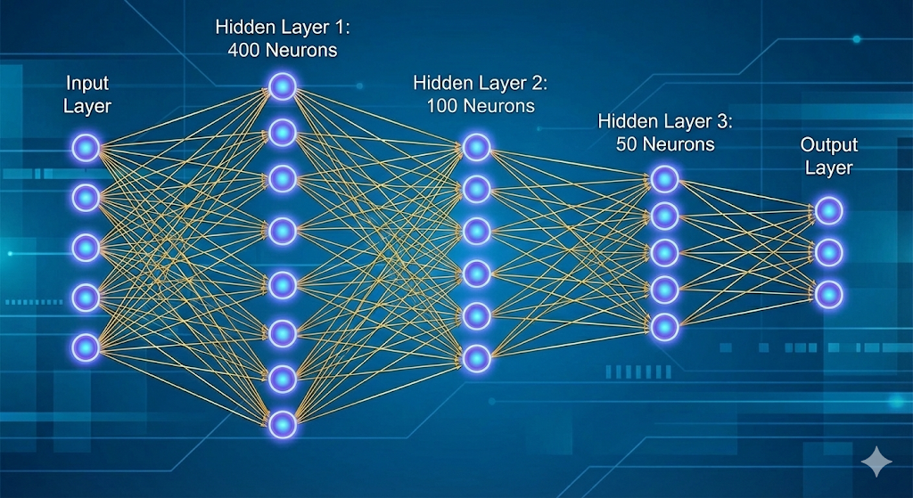

# Memoria Técnica: Sistema de Detección de Emociones en Audio (SER)

**Asignatura:** Procesamiento del habla, visión e interacción multimodal 
> [!note]
>**Autores:**
>* Daniel Marchena Jiménez
>* Javier Arias Fuentes
>* Zohair Mouhim Gharafi

---

## Índice
1. [Introducción y Contexto](#1-introducción-y-contexto)
2. [Selección del Dataset y Preprocesamiento de Audio](#2-selección-del-dataset-y-preprocesamiento-de-audio)
    1. [Arquitectura de Datos (Multi-Corpus)](#21-arquitectura-de-datos-multi-corpus)
    2. [Extracción de Características](#22-extracción-de-características)
3. [Metodología en Orange Data Mining](#3-metodología-en-orange-data-mining)
    1. [Estrategias de Experimentación](#31-estrategias-de-experimentación)
    2. [Carga y Transformación de Datos](#32-carga-y-transformación-de-datos)
    3. [Selección de Características](#33-selección-de-características)
    4. [Configuración de Red Neuronal](#34-configuración-de-red-neuronal)
    5. [Configuración del Flujo de Validación](#35-configuración-del-flujo-de-validación)
4. [Modelado y Algoritmos Seleccionados](#4-modelado-y-algoritmos-seleccionados)
    1. [Random Forest (Bosques Aleatorios)](#41-random-forest-bosques-aleatorios)
    2. [Neural Network (Red Neuronal - MLP)](#42-neural-network-red-neuronal---mlp)
5. [Análisis de Resultados y Discusión](#5-análisis-de-resultados-y-discusión)
    1. [Evaluación (Confusion Matrix y ROC)](#51-evaluación-confusion-matrix-y-roc)
    2. [Comparativa](#52-comparativa)
    3. [La Paradoja de RAVDESS](#53-la-paradoja-de-ravdess)
    4. [El "Gap" de Producción](#54-el-gap-de-producción)
6. [Conclusión](#6-conclusión)

---

## 1. Introducción y Contexto

El objetivo de este proyecto es desarrollar un sistema de Inteligencia Artificial capaz de clasificar el estado emocional de un hablante basándose exclusivamente en las características acústicas de su voz. Siguiendo los requisitos de la práctica, se ha prescindido de cualquier técnica de Transcripción Automática del Habla (ASR) o Procesamiento de Lenguaje Natural (NLP), centrando el análisis en las propiedades paralingüísticas de la señal de voz (física del sonido).

El sistema busca resolver el problema de la clasificación de emociones (SER - Speech Emotion Recognition) en un entorno de "Caja Negra", donde el modelo no entiende *qué* se dice, sino *cómo* se dice.

El sistema se ha diseñado para clasificar audios en categorías emocionales **simplificadas** (Positiva, Neutra, Negativa) o **extendidas** (enfadado, feliz, neutro, triste), utilizando un enfoque híbrido: extracción de características mediante Python (`librosa`) y modelado mediante minería de datos visual en **Orange Data Mining**.

---

## 2. Selección del Dataset y Preprocesamiento de Audio

### 2.1. Arquitectura de Datos (Multi-Corpus)
Para asegurar la robustez del sistema, no nos hemos limitado a un único dataset. Hemos estructurado los datos en tres niveles de validación:

1.  **Dataset de Entrenamiento (ssi-speech-emotion-recognition):** Corpus principal ([`ssi_custom_features.csv`](/data/processed/ssi_custom_features.csv)) utilizado para el aprendizaje de los modelos. Dataset `stapesai/ssi-speech-emotion-recognition` disponible en el repositorio de [Hugging Face](https://huggingface.co/datasets/stapesai/ssi-speech-emotion-recognition).
La elección de este conjunto de datos para entrenar el modelo se justifica por los siguientes factores:
    - **Consistencia y Accesibilidad:** Al utilizar un dataset curado y alojado en Hugging Face, se garantiza el acceso a datos estructurados y listos para su procesamiento, evitando inconsistencias de formato comunes en la recolección manual de archivos de audio.
    - **Calidad de Audio:** Este dataset proporciona grabaciones con una relación señal-ruido (SNR) adecuada, lo que facilita la extracción de características limpias (MFCCs, Chroma) sin la interferencia excesiva de ruido ambiental.
    - **Etiquetado Fiable:** Las muestras contienen etiquetas emocionales claras, lo cual es ideal para el entrenamiento supervisado de modelos base, permitiendo al sistema aprender patrones acústicos prototípicos de cada emoción.

2.  **Dataset de Control (RAVDESS):** Dataset [*Ryerson Audio-Visual Database of Emotional Speech and Song*](/data/processed/testing_ravdess.csv). Al ser grabaciones de actores profesionales en estudio anecoico, nos sirve como ["Ground Truth"](https://www.ibm.com/es-es/think/topics/ground-truth) de emociones arquetípicas. Dataset `RAVDESS` disponible en [Kaggle](https://www.kaggle.com/datasets/uwrfkaggler/ravdess-emotional-speech-audio/)
3.  **Dataset Experimental (Voces Propias):** Grabaciones realizadas por el equipo para testear el sistema ante micrófonos no profesionales y ruido ambiente.

### 2.2. Extracción de Características
Se ha desarrollado un script en Python utilizando la librería `librosa`. Tras diversas pruebas, se determinó que los **MFCCs (Mel-frequency cepstral coefficients)** eran los predictores más fuertes. Se extraen 40 coeficientes por audio y se calcula su media aritmética para generar un vector numérico representativo de cada archivo `.wav`.
| Parámetro | Detalle |
| :--- | :--- |
| Herramienta | Python + Librería `librosa` |
| Repositorio | - [Corpus principal](https://huggingface.co/datasets/stapesai/ssi-speech-emotion-recognition)   - [Dataset tests](https://www.kaggle.com/datasets/uwrfkaggler/ravdess-emotional-speech-audio/) |
| Decisión de diseño | Script externo para control total sobre ventana de análisis y parámetros matemáticos. El audio no estructurado se convierte a datos tabulares para ML. |

#### Características Extraídas y Justificación
Se extrajeron las características físicas del archivo `.wav` y se calcularon sus medias para obtener un vector de longitud fija por cada audio. Las principales variables seleccionadas fueron:

- **MFCCs (Mel-frequency cepstral coefficients):** Se extrajeron 40 coeficientes.
    - Por qué: Los MFCC replican la audición humana y capturan el timbre de la voz. Son la característica más discriminante en el reconocimiento de emociones, ya que permiten diferenciar la "aspereza" de la ira frente a la "suavidad" de la calma, independientemente de lo que se diga.
- **Chroma (Cromagrama):**
    - Por qué: Relacionado con la armonía y el tono musical. Ayuda a distinguir variaciones tonales intensas.
- **Mel Spectrogram & Spectral Contrast:**
    - Por qué: Miden la distribución de energía en diferentes frecuencias y la diferencia entre picos y valles del espectro, útiles para detectar la intensidad emocional (Arousal).

El resultado de este proceso es un archivo estructurado (Excel/CSV) donde cada fila es un audio y cada columna una característica numérica, listo para Orange.

---

## 3. Metodología en Orange Data Mining

El flujo de trabajo en Orange se ha diseñado para realizar una **Validación Cruzada entre Corpus (Cross-Corpus Validation)**. A diferencia de la validación tradicional, esto nos permite evaluar la capacidad de generalización del modelo ante nuevos locutores y condiciones acústicas.

### 3.1. Estrategias de Experimentación
Hemos implementado dos tuberías de procesamiento distintas (archivos `.ows`) para evaluar cómo la definición de las clases afecta al rendimiento:

* **Estrategia A: Agrupación (3 Clases):** Se han fusionado emociones semánticamente cercanas en tres emociones principales (Positiva, negativa, neutra) para reducir la complejidad y buscar una mayor tasa de acierto global.  Dado que esta fusión generó una "super-clase" con muchas más muestras que el resto, se produjo un **desbalance de clases**. Para evitar que el modelo adquiriera un **sesgo** hacia la emoción predominante, aplicamos **submuestreo** (undersampling), limitando artificialmente la cantidad de instancias de dicha clase para equilibrar la distribución antes del entrenamiento.

* **Estrategia B: Selección Estándar (4 Emociones Básicas):** Se ha filtrado el dataset para conservar únicamente las emociones universales de Ekman: **Ira, Tristeza, Felicidad y Neutral**, descartando el resto. 

### 3.2. Carga y Transformación de Datos
- **File (Archivo):** Importación del dataset generado por el script Python (`ssi_custom_features.xlsx`).
- **Edit Domain (Editar Dominio):** Decisión Crítica: Este nodo se utiliza para cumplir con el requisito de simplificación de emociones. En este nodo se elige seguir con la estrategia **A** o **B** definidas en el apartado anterior. En este nodo también aseguramos que la variable objetivo sea categórica.
- **Select Columns (Seleccionar Columnas):** Se definió la columna `emotion` como Target (Objetivo) y los coeficientes numéricos (MFCCs, Chroma, etc.) como Features (Características). 

### 3.3. Selección de Características
- **Rank (Ranking):**
    - Por qué: El script extrae muchas columnas (más de 40). No todas aportan información útil; algunas pueden introducir ruido.
    - Método: Se utilizó Information Gain (Ganancia de Información) o ReliefF para ordenar qué características físicas discriminan mejor entre emociones. Esto nos permite ver, por ejemplo, que los primeros coeficientes MFCC suelen ser más importantes que los últimos.
    - **Conclusión:** Al realizar pruebas excluyendo las columnas menos significativas, observamos que la precisión del modelo **empeoraba**. Esto confirma que, para nuestro volumen de datos, utilizar las 40 variables no supone un problema. Por tanto, decidimos mantenerlas todas para no perder información útil del audio, descartando que esto fuera a causar problemas de aprendizaje o sobreajuste (**overfitting**).

### 3.4. Configuración de Red Neuronal
Hemos configurado la red neuronal por defecto añadiendo 2 capas ocultas extra y configurando el número de neuronas en forma de embudo.

- **Arquitectura:** 
    - [200, 60, 30] neuronas.

 
- **Justificación del Diseño:**

    - **Capa 1 (200 neuronas):** Una capa inicial ancha para capturar una gran variedad de combinaciones de bajo nivel de los 40 coeficientes MFCC de entrada.

    - **Capa 2 (60 neuronas) y Capa 3 (30 neuronas):** Reducción progresiva de la dimensionalidad. Esta estructura obliga a la red a "comprimir" la información, sintetizando los patrones más relevantes y descartando el ruido acústico.

- **Función de Activación:** ReLu (Rectified Linear Unit), seleccionada por su eficiencia computacional y por mitigar el problema del desvanecimiento del gradiente en redes de varias capas.

- **Solver**: Adam, optimizado para manejar grandes volúmenes de datos y converger más rápido que el descenso de gradiente estocástico tradicional.

### 3.5. Configuración del Flujo de Validación
El diseño en Orange combina dos métodos de evaluación simultáneos:

1.  **Validación Interna (Test & Score):** Se aplica *Cross-Validation (k-fold)* sobre el dataset de entrenamiento. Esto elimina el sesgo de partición y verifica que el modelo es estadísticamente estable con los datos conocidos.
2.  **Inferencia Externa (Predictions):** Se entrena el modelo con la totalidad de los datos de entrenamiento y se lanzan predicciones sobre los datasets de **RAVDESS** y **Voces Propias**. Esto mide el rendimiento real ante el *Domain Shift* (cambio de micrófono y entorno).

---

## 4. Modelado y Algoritmos Seleccionados

Se han evaluado dos familias de algoritmos para la clasificación:

### 4.1. Random Forest (Bosques Aleatorios)
Seleccionado por su capacidad para manejar datos de alta dimensionalidad (40 MFCCs) y su resistencia al sobreajuste en datasets de tamaño medio. No requiere normalización previa de los datos.

### 4.2. Neural Network (Red Neuronal - MLP)
Configurada como un Perceptrón Multicapa. Aunque tiene un mayor potencial teórico para capturar relaciones no lineales complejas entre los coeficientes cepstrales, ha mostrado mayor sensibilidad a la cantidad de datos disponibles.

---

## 5. Análisis de Resultados y Discusión

### 5.1. Evaluación (Confusion Matrix y ROC)
Los nodos Confusion Matrix y ROC Analysis se utilizaron para interpretar el rendimiento:

| Herramienta | Objetivo | Observación Típica |
| ---: | ---: | ---: |  
| Matriz de Confusión | Ver no solo **cuánto** acierta el modelo, sino **cómo** se equivoca. | Es común que el modelo confunda emociones de alta energía (Angry vs Happy) o de baja energía (Sad vs Neutral). |
| Curva ROC | Mostrar la capacidad del modelo para separar las clases. | Un área bajo la curva (AUC) superior a 0.8 indica un buen modelo. |

### 5.2. Comparativa
En general, Random Forest suele ofrecer un rendimiento más estable e inmediato con datasets de tamaño medio (< 5000 audios) y características **MFCC**, gracias a su robustez intrínseca. Por otro lado, la Red Neuronal, aunque sensible al **overfitting** con datasets pequeños, tiene un mayor potencial para capturar patrones más finos y complejos en grandes volúmenes de datos.

| Modelo | Ventaja Principal con SER | Rendimiento Típico (MFCC) |
| ---: | ---: | ---: |
| **Random Forest** | Estabilidad, robustez, no requiere normalización. | Alto rendimiento con datasets medianos. |
| **Neural Network (MLP)** | Capacidad para capturar relaciones no lineales complejas. | Mayor potencial con datasets grandes; sensible a overfitting. |

### 5.3. La Paradoja de RAVDESS
Se ha observado un fenómeno contraintuitivo: los modelos obtienen un rendimiento notablemente superior ( **88-94% de Accuracy**) en el dataset externo RAVDESS que en el propio dataset de entrenamiento (~70%).

**Interpretación Técnica:**
Este resultado sugiere que el modelo ha aprendido a identificar **arquetipos emocionales de alta intensidad**. RAVDESS, al ser interpretado por actores, presenta emociones "de caricatura" con rasgos acústicos muy marcados y separables. Por el contrario, las grabaciones naturales o menos actuadas presentan fronteras difusas entre emociones (sutileza), lo que dificulta la clasificación.

### 5.4. El "Gap" de Producción
El rendimiento desciende en el dataset de **Voces Propias**. Esto evidencia la dependencia del modelo respecto a la calidad del canal de audio (micrófono y ruido de fondo) y la dificultad de simular emociones genuinas sin entrenamiento actoral. El modelo busca patrones de intensidad y timbre que una persona no entrenada no siempre produce al fingir una emoción.

---

## 6. Conclusión

El desarrollo de este sistema ha demostrado la viabilidad de detectar emociones basándose puramente en la física del sonido, validando la importancia de los **MFCCs** como huella dactilar emocional. La combinación de la extracción precisa de características con `librosa` y la validación rápida de modelos en Orange ha permitido iterar ágilmente en el diseño del sistema.

La principal lección aprendida radica en la importancia de la **calidad y naturaleza de los datos**: un modelo entrenado con datos generales funciona excepcionalmente bien en entornos controlados y arquetípicos (RAVDESS), pero enfrenta desafíos de generalización ante el ruido y la sutileza de la voz humana natural. El uso de validación *Cross-Corpus* ha sido fundamental para identificar estas limitaciones, que habrían permanecido ocultas con una simple validación tradicional.

Como mejora futura, se podría implementar una red neuronal convolucional (CNN) directamente sobre los espectrogramas, eliminando la necesidad de calcular medias estadísticas, aunque esto requeriría mayor potencia computacional.
